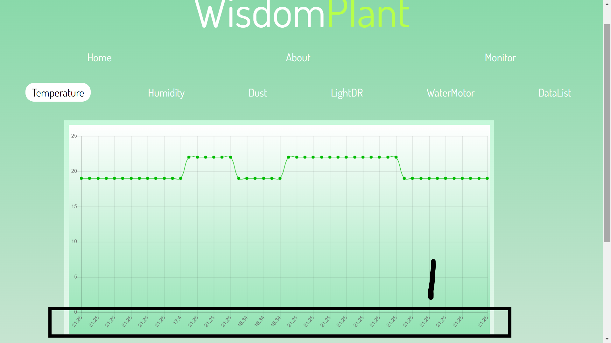
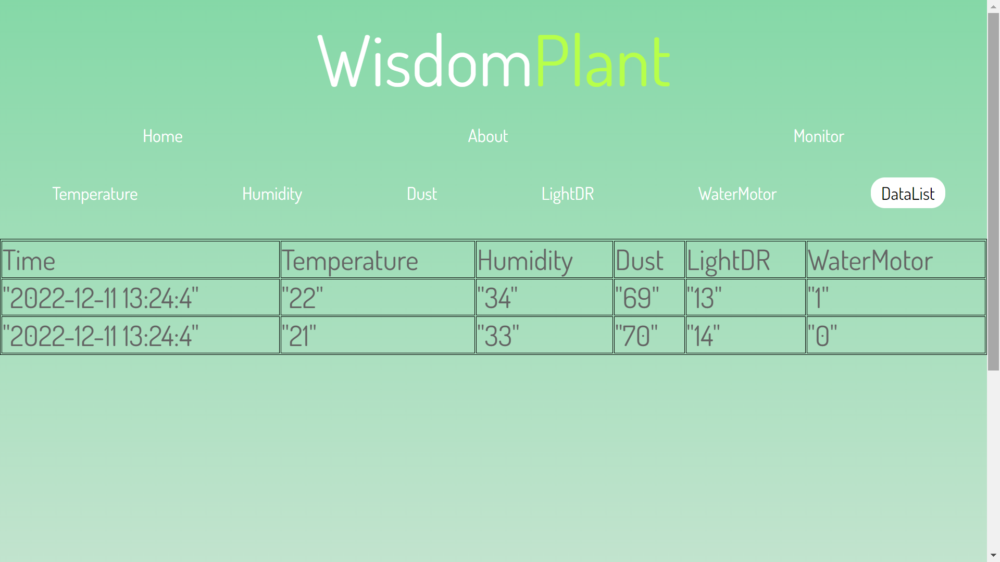
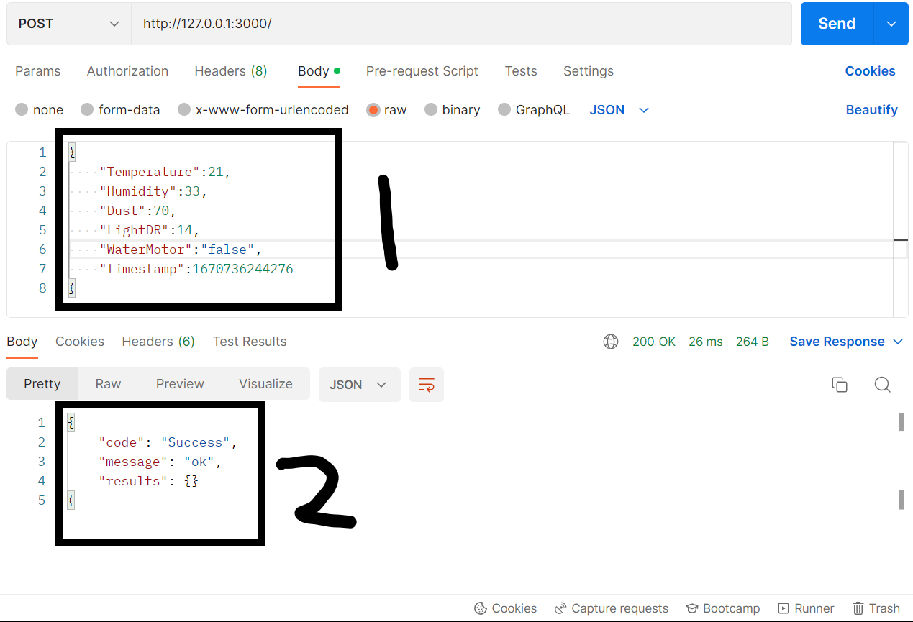
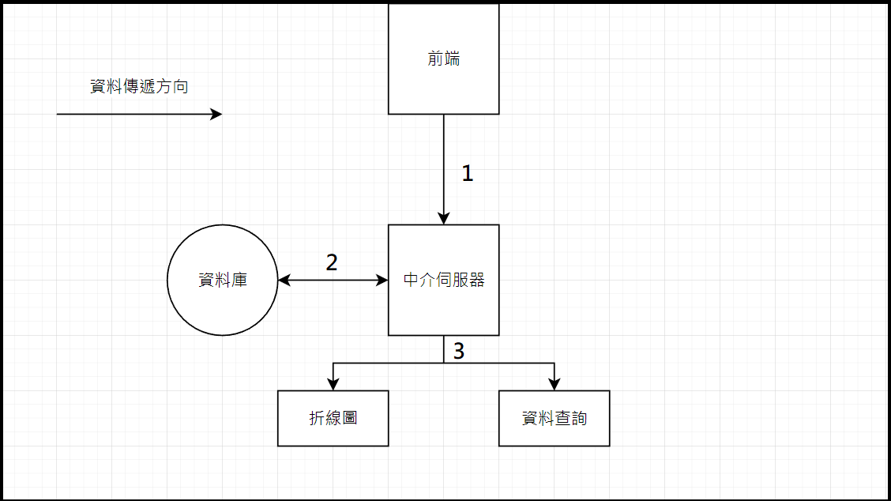

# 伺服器
## 介紹
### 文字說明
```
透過接收前端發送的json格式的資料，將這些資料以圖形，數值的方式呈現在HTML上，並且將這些資料回傳至資料庫。
```
PS: 由於資料庫是私用，有關資料庫的部分在此專案將不被使用。

### 使用方式
`open terminal`
`cd .\my_app\`
`enter -> node main.js  <-`
`open url -> http://127.0.0.1:3000/home `

### 圖片說明





### 資料傳遞過程


***
 
### 總體結構
  - **中介伺服器** 
    - node.js
  - **前端** 
  - **資料庫**
    - Mysql
  - **HTML** 
    - chart.js
    - jquery
    - CSS
    - javaScript
***
**Node.js**
  - **版本**
    - v16.16.0
  - **npm(套件)**
    - 版本
    8.19.1
    - express 
    建立伺服器的核心
    - chart.js
    用來建立圖表，可是主伺服器尚未用到。
    - 
***
**npm安裝套件方式**

`npm install express`

**npm解除安裝套件方式**

`npm uninstall express`

 - ngrok --scheme http http 3000 創造未加密網址
